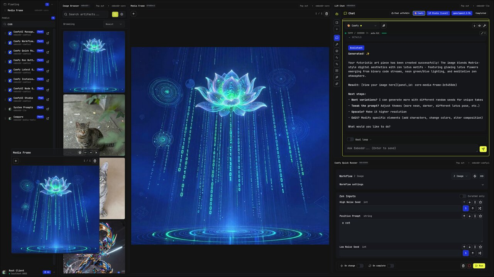
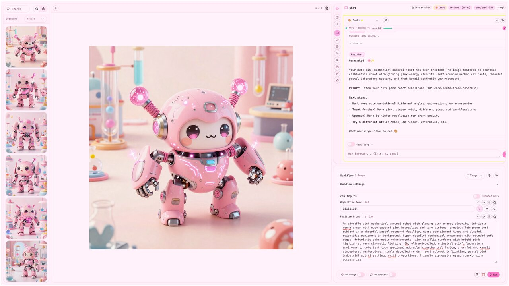
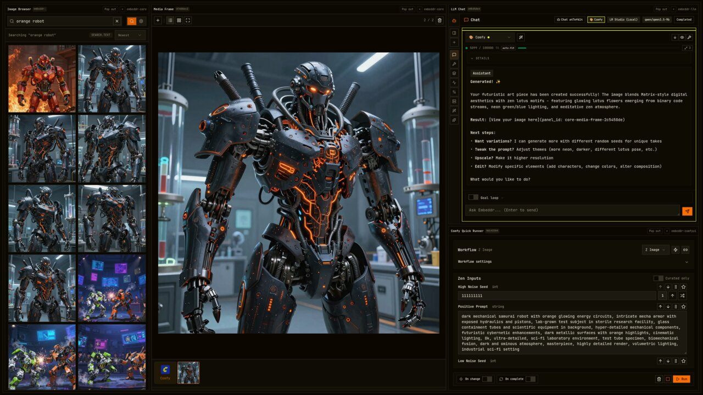
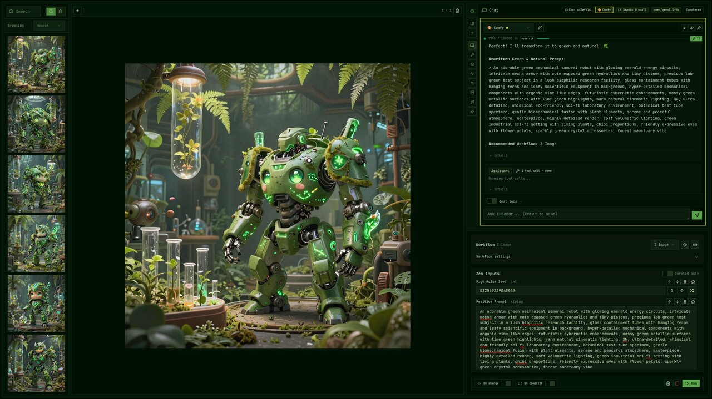

<div align="center"><a name="readme-top"></a>


<h1>Embeddr Sprout</h1>

A lightweight Embeddr client built on the Zen Shell framework.

[![license][license-image]][license-url]

</div>

---



## What is Sprout?

Sprout is a minimal Embeddr frontend that connects to any Embeddr instance and renders its plugin panels. It's built on [@embeddr/zen-shell](https://github.com/embeddr-net/zen-shell) — the same panel framework that powers the full Embeddr frontend.

Use Sprout as:
- A **lightweight client** when you don't need the full frontend
- A **reference implementation** for building custom Embeddr UIs
- A **starting point** for your own Embeddr-powered application

## Quick Start

```sh
pnpm install
pnpm dev
```

Point it at your Embeddr instance:

```sh
VITE_BACKEND_URL="http://localhost:8003/api/v1" pnpm dev
```

## Themes

Sprout supports live theme switching with full customization.

<p>



</p>

## What's Included

- Zen Shell integration with panel management
- Sidebar with connection status, plugin status, panel launcher
- Theme controls with live switching
- Command bar
- Tiling layout for panels
- DevTools panel

## Architecture

```
Sprout (this repo)
  └── @embeddr/zen-shell     — panel framework, plugin loader
       ├── @embeddr/react-ui  — UI components
       └── @embeddr/client-typescript — API client
```

Sprout is intentionally minimal — the heavy lifting happens in zen-shell. This makes it easy to build your own Embeddr frontend by swapping Sprout's layout for your own.

## Packages

[![react-ui version][react-ui-image]][react-ui-url]
[![license][license-image]][license-url]

[react-ui-image]: https://img.shields.io/npm/v/%40embeddr%2Freact-ui?style=flat-square&logo=React&logoColor=%2361DBFB&label=react-ui&labelColor=%232f2f2f&color=%234f4f4f
[react-ui-url]: https://www.npmjs.com/package/@embeddr/react-ui

[license-image]: https://img.shields.io/github/license/embeddr-net/sprout?style=flat-square&logoColor=%232f2f2f&labelColor=%232f2f2f&color=%234f4f4f
[license-url]: https://github.com/embeddr-net/sprout/blob/main/LICENSE

## License

Copyright 2026 Embeddr Labs and Contributors

Licensed under the Apache License, Version 2.0.
